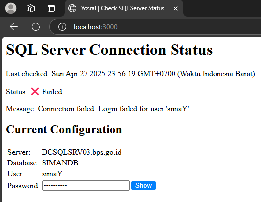
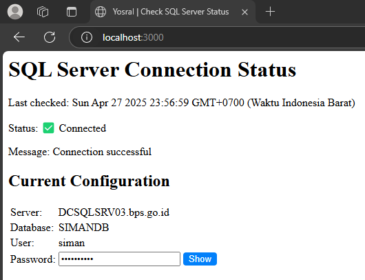

## BACA TERLEBIH DAHULU!!!
- Digunakan untuk cek status koneksi database khusus *driver* Microsoft SQL Server dari wev hosting tertentu
- Duplikat dan ubah nama *.env.example* -> *.env*, lalu isi kredensial koneksi *database*-nya
- Run `npm install` untuk *install* dependensi
- Sesuaikan `DML` dengan modifikasi file `app.js`  jika diperlukan
- Run `npm run dev` jika *deployment* dilakukan pada  `localhost` dan atau *web server* yang dapat diakses *resource*-nya (`SSH`, `jumphost`, dsb.)
- Untuk *deployment* web server non-localhost, run:
    ``` rm -rf node_modules .dist
        npm cache clean --force
        npm install --omit=dev
        npm run build
    ```
- Kemudian *upload* hasil *build*-nya: `.dist`, `package.json`, `package-lock.json`, dan `app.js`,  ke direktori *web server* yang diinginkan
- *Upload* pula berkas `.env`, dan pastikan *permissions* dari setiap direktori dan berkas mengikuti *best practice* tim ops./infrastruktur
- Jika variabel di `.env` berubah, maka pastikan `nodejs` pada web hosting direstart
- Pastikan di-*run* di lingkungan *development* atau *testing*, jangan sesekali di *production*, rawan *hacked*
- Setelah sudah digunakan, pastikan agar segera di-*remove/prune/hide* dari *stack/framework* tempat *deployment*, beserta *routes*-nya yang terkait
- Done, salam sukses!!! kunjungi dan *follow* saya di [sini](https://github.com/red-ruby-quay) atau [ini](https://git.bps.go.id/yosral) jika ingin berkenalan dan atau konsultasi lebih lanjut
- Preview:



